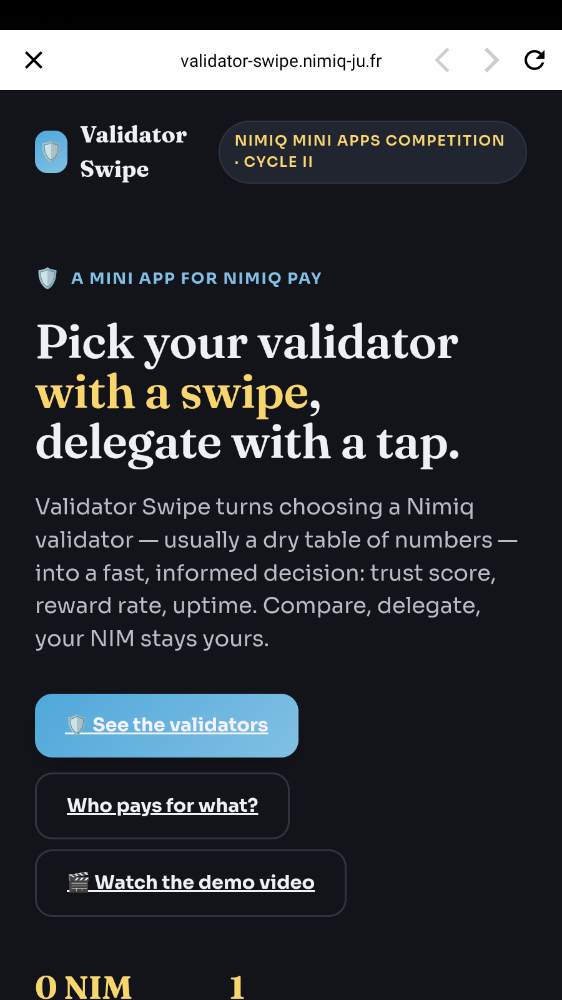
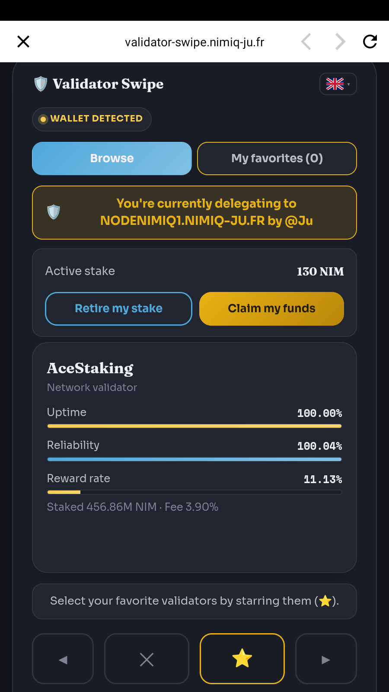
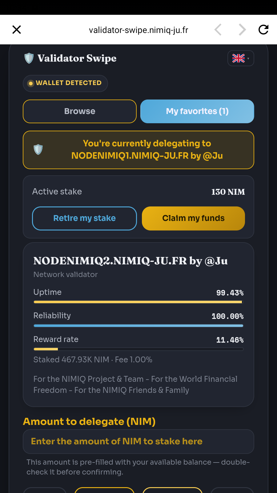
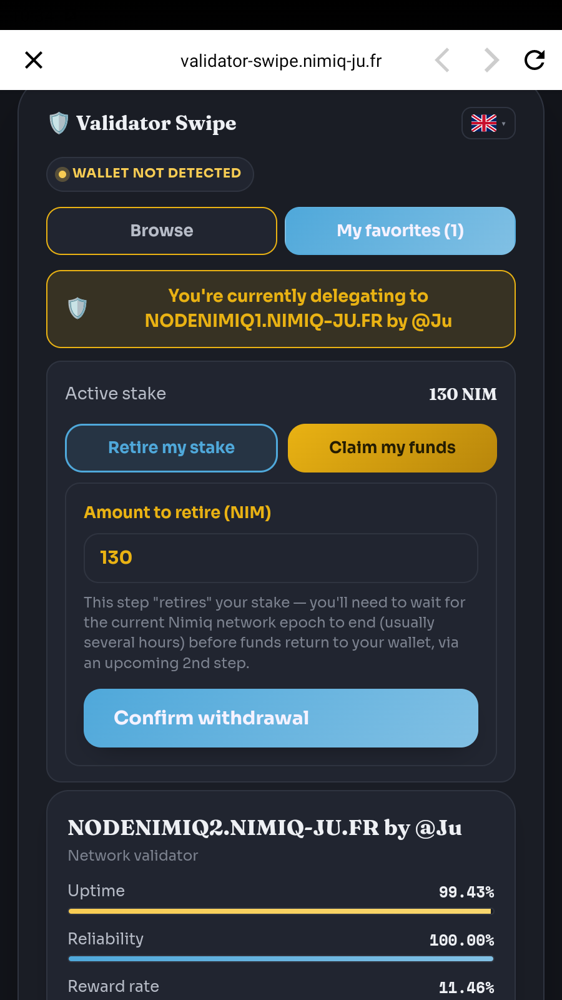

# 🛡️ Validator Swipe

**Pick a Nimiq validator with a swipe, delegate with a tap.**

Validator Swipe is a [Nimiq Pay](https://nimiq.com) mini app that turns choosing a
validator — usually a dry table of numbers — into a fast, informed decision, then lets
you delegate (stake) your NIM in one tap. It also covers the rest of the staking
lifecycle: switch validator, add stake, retire, and claim your funds back.

Built by **@Ju'Team** (Ju & Claude) for the Nimiq Mini Apps Competition, Cycle II.
Licensed under [MIT](LICENSE).

---

## Table of contents

- [Features](#features)
- [Screenshots](#screenshots)
- [How staking works here](#how-staking-works-here)
- [Quick start](#quick-start)
- [Architecture in 10 lines](#architecture-in-10-lines)
- [Running your own instance](#running-your-own-instance)
- [Documentation](#documentation)
- [Good to know](#good-to-know)
- [Project status](#project-status)
- [Reporting a bug](#reporting-a-bug)
- [Contributing & security](#contributing--security)
- [License](#license)

## Features

- **Every active validator, real data.** Uptime, reliability, reward rate, delegation
  fee and total stake for all active validators (39 at the time of writing), not a curated
  shortlist. Missing metrics are shown as `—`, never guessed.
- **Two-phase flow.** *Browse* (skip / set aside — free, no transaction) then
  *My favorites* (the only place a transaction can be sent). Nothing is ever delegated
  by accident while browsing.
- **Complete staking lifecycle**, driven by the account's real on-chain state:
  create a staker, add to an existing stake, switch validator, **retire** a stake,
  then **claim** the funds after the network waiting period.
- **Always in sync with the chain.** After every transaction the app re-reads the on-chain state
  until it is reflected, and shows a "waiting for the network to confirm" line meanwhile.
- **Follows the user journey.** After the star or the shield, when switching tabs and when a message closes, the view is gently
  re-framed on the central card; after typing an amount, the page returns to where it was when the keyboard closes.
  Tapping the app title puts the app back in its nominal position.
- **One tap, one transaction.** Duplicate taps, double connections and page reloads cannot send
  the same action twice (see [docs/ARCHITECTURE.md](docs/ARCHITECTURE.md)).
- **Runs inside Nimiq Pay *and* in a regular browser.** Inside Nimiq Pay it uses the
  Mini App SDK. Outside, a "Connect" button uses the Nimiq Hub (implemented; see
  [docs/KNOWN-LIMITATIONS.md](docs/KNOWN-LIMITATIONS.md) for what has been tested).
- **Non-custodial by design.** The app never sees a private key: every transaction is
  signed in Nimiq Pay or the Nimiq Hub. See [SECURITY.md](SECURITY.md).
- **Honest demo mode.** With no wallet connected the app stays browsable, and any
  simulated action is clearly labeled as a demo — it can never be mistaken for a real one.
- **11 languages** (fr, en, es, zh, ja, ko, de, pt, ru, tr, ar), English by default.
  See [docs/I18N.md](docs/I18N.md).
- **Single static file.** No build step, no bundler, no framework — one `index.html`.

## Screenshots

Captured on a phone with the live app (English interface). The validator names shown are
public validators; no wallet address is visible.

| | |
|---|---|
|  |  |
| **1. Landing page.** The mini app's entry page: what it does, plus buttons to jump to the validators, to the "who pays for what" explanation, and to the demo video. | **2. Browse tab.** A wallet is detected; the gold banner shows the current on-chain delegation, "My stake" shows the active stake with the *Retire* and *Claim* buttons, and the card shows real uptime, reliability, reward rate, total stake and fee. Below: back / pass / set aside (star) / next. |
|  |  |
| **3. My favorites — delegate.** The only place a transaction can be sent. When the main-account balance reads 0 the amount field shows an explicit placeholder, and a one-line hint says the available balance is shown in Nimiq Pay. | **4. Pre-filled amount.** When the wallet's spendable balance is known, the amount is pre-filled with it (editable), with a reminder to double-check before confirming. |
|  | |
| **5. Retire stake.** The amount is pre-filled with the active stake; the text explains that funds return to the wallet once the current network epoch has ended, after which they can be claimed. | |

## How staking works here

Staking lets you put NIM to work: you *delegate* it to a validator (a node that keeps
the network running) and earn a share of the rewards, without your funds ever leaving
your control — the validator never holds your NIM.

Nimiq's staking contract allows **one staker per address**. The app therefore checks
your on-chain state and picks the right transaction:

| Your account | Action | Transaction |
|---|---|---|
| No staker yet | Delegate | create staker |
| Staker exists, same validator | Add funds | add stake |
| Staker exists, other validator | Switch validator | update staker (moves the whole stake) |
| Want your funds back | Step 1: wait for epoch end | retire stake |
| Retired stake available | Step 2: claim | remove stake |

## Quick start

The app is one static HTML file, so trying it locally takes seconds:

```bash
git clone https://github.com/Julien59247787/nimiq-app-validatorswipe.git
cd nimiq-app-validatorswipe
python3 -m http.server 8080      # any static file server works
# open http://localhost:8080
```

Opened like this, the app runs but the live validator list and on-chain staker status
are **not** available: they come from a small backend API (`/api/v2/...`) that a static
server does not provide. The app degrades gracefully (built-in example validators,
demo mode). To get the full experience, deploy it with the backend described in the
[Operator Guide](docs/OPERATOR-GUIDE.md).

Good to know when running from a clone: the "Watch the demo video" button links to a
`demo.mp4` that is not part of the repository (it is a dead link locally), and the
`og:image` link-preview URL points at the original deployment. Both are covered in the
[Operator Guide](docs/OPERATOR-GUIDE.md#6-customizing-for-your-own-validators).

## Architecture in 10 lines

1. One self-contained `index.html` (HTML + CSS + vanilla JS, no build step).
2. Inside Nimiq Pay: `@nimiq/mini-app-sdk` (loaded from a CDN) provides the wallet
   account and signs/sends staking transactions.
3. Outside Nimiq Pay: `@nimiq/hub-api` opens the Nimiq Hub popup to pick an address;
   transactions are built locally with `@nimiq/core` and signed + broadcast through the Hub.
4. `GET /api/v2/validators-list` supplies the validator list and their metrics.
5. `GET /api/v2/staker-status?address=…` supplies the account's real staking state and
   spendable balance, so the UI always reflects the chain rather than local guesses.
6. Both endpoints are served by your own backend, next to a Nimiq node — see the Operator Guide.
7. All user-visible text lives in one `T` dictionary (11 languages, same keys everywhere).
8. No cookies, no analytics, and nothing is sent to a third party. Storage is local to the browser only:
   the chosen language (`localStorage`); the action currently in flight, `vs:pending` (`sessionStorage` and
   `localStorage`, cleared on confirmation or after 60 s); and a short list of the last actions, `vs:lastActions`,
   used to ignore duplicate taps (30 s window, up to 8 entries, contains the wallet address, never transmitted;
   overwritten later, or removed by clearing the site data).
   Fonts and libraries are loaded from third-party CDNs (Google Fonts, jsDelivr), which
   necessarily see the visitor's IP address.
9. A strict Content-Security-Policy is expected; the inline script is allowed by hash.
10. Details: [docs/ARCHITECTURE.md](docs/ARCHITECTURE.md).

## Running your own instance

Another Nimiq validator operator can deploy this mini app on their own infrastructure
and list their own validators first. Everything needed — backend endpoints and their
schemas, Nimiq node requirements, reverse proxy, CSP and hash computation, deployment
steps and a verification checklist — is in **[docs/OPERATOR-GUIDE.md](docs/OPERATOR-GUIDE.md)**.

## Documentation

| Document | Purpose |
|---|---|
| [docs/OPERATOR-GUIDE.md](docs/OPERATOR-GUIDE.md) | Deploy and operate the mini app on your own nodes |
| [docs/ARCHITECTURE.md](docs/ARCHITECTURE.md) | How the app is built and why |
| [docs/I18N.md](docs/I18N.md) | Translations: structure, key parity, adding a language |
| [docs/KNOWN-LIMITATIONS.md](docs/KNOWN-LIMITATIONS.md) | Known limitations, including a main-account balance of 0 |
| [CHANGELOG.md](CHANGELOG.md) | History since the first publication (1.0.0) and ideas without a date |
| [CONTRIBUTING.md](CONTRIBUTING.md) | How to contribute |
| [SECURITY.md](SECURITY.md) | Security model and how to report a vulnerability |

## Good to know

- **A balance of 0 in the app.** A wallet can show **0** on its main account while Nimiq Pay
  shows funds: funds received through a swap (for example a top-up inside Nimiq Pay) sit in a swap
  contract that Nimiq Pay can still use when staking. The app can only read the main-account
  balance, so it does not pre-fill the amount and shows a one-line hint under the amount field; it
  never blocks staking. Details: [docs/KNOWN-LIMITATIONS.md](docs/KNOWN-LIMITATIONS.md).
- **Confirmation takes a few seconds.** Blocks are about 1 second apart and a staking transaction is
  usually included about 2 blocks after it is sent (a rare outlier can take about 2 minutes). The
  app keeps checking for up to 60 seconds. The transaction history shown by a wallet app may lag
  behind the chain by up to a minute; the app reads the chain itself.
- **View re-framing is tuned for Nimiq Pay's in-app browser; elsewhere it is neutral.** It runs automatically only when
  the host reports its top bar height; otherwise only a tap on the app title re-frames (see the known limitations).
- **Reliability is capped at 100 %.** The statistics source can publish a value above 100 % for some validators;
  the API caps it at 100 % (a fraction between 0 and 1) and the app shows it as provided.

## Project status

**Version 1.0.0** is the first publication: the version submitted to the Nimiq Mini Apps Competition
(Cycle II) on 2026-09-18. Later changes are listed under "Changes since the competition submission"
in the [CHANGELOG](CHANGELOG.md). The complete real staking cycle (create / add / switch / retire /
claim) was verified on a real device with real funds; Add Stake was re-checked on a phone with a
recent build, while Create Stake with funds held in a swap contract and retire / claim with the
latest builds have not been tested end to end on a device. Some
translations are machine-generated and have not been reviewed by native speakers — corrections are
welcome (see [docs/I18N.md](docs/I18N.md)).

## Reporting a bug

Found a problem? Use the **Report a bug** link in the app's footer, or [open an issue](https://github.com/Julien59247787/nimiq-app-validatorswipe/issues/new/choose)
with the bug template. Please include where you ran the app, which action failed and the error
message (with its technical detail), and **never** share private keys, seed phrases, passwords or
your full wallet address. Security vulnerabilities go through [SECURITY.md](SECURITY.md) instead.

## Contributing & security

Contributions are welcome — please read [CONTRIBUTING.md](CONTRIBUTING.md) and the
[Code of Conduct](CODE_OF_CONDUCT.md). To report a vulnerability, follow
[SECURITY.md](SECURITY.md); please do not open a public issue for security problems.

## License

[MIT](LICENSE) © 2026 Julien CURTO.

---

Made with ♥ by **@Ju'Team** (Ju & Claude) · [@julien59247787](https://x.com/julien59247787)
